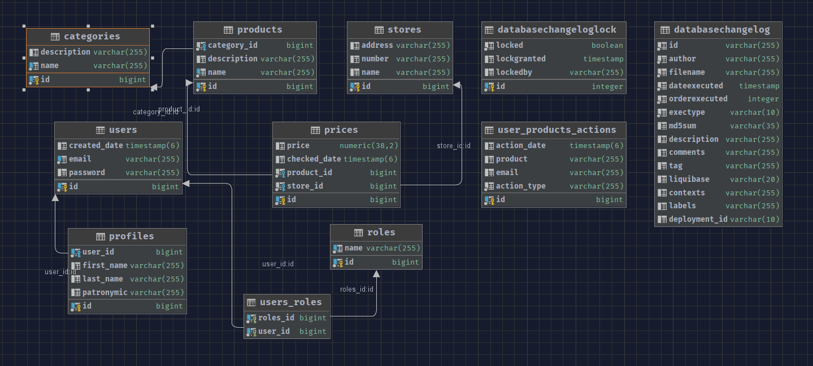

# Senla Project

## Описание

**Senla Project** — это Spring Boot приложение, которое предоставляет функционал для управления пользователями, товарами и торговыми точками. Проект включает в себя возможности для регистрации пользователей, редактирования профилей, управления товарами и ценами, а также их отслеживания и анализа. Используется база данных PostgreSQL с миграциями Liquibase для управления схемой базы данных. Приложение упаковано в JAR файл и запускается в Docker-контейнерах.

## Функционал

- **Регистрация пользователей**: Поддержка ролей администратора и обычного пользователя.
- **Редактирование профиля**: Возможность редактировать личные данные пользователей.
- **Справочник категорий товаров и торговых точек**: CRUD методы и функции для получения всех сущностей с фильтрацией и пагинацией.
- **Просмотр и управление товарами**: Поиск и фильтрация товаров по категориям, добавление/редактирование/удаление товаров.
- **Ценовые привязки**: Возможность привязать цену к товару в конкретном магазине.
- **Отслеживание цен**: Мониторинг динамики цен на товары в формате .xlsx.
- **Сравнение цен**: Сравнение цен по позициям в различных магазинах.
- **Графическое отображение**: Возможность графического отображения динамики изменения цен.
- **Пакетное добавление**: Импорт информации о ценах и продуктах в формате .xlsx.
- **Глобальный обработчик исключений**: Обработка ошибок на уровне приложения.
- **Логирование**: Реализовано логирование событий и действий приложения.
- **Миграции базы данных**: Использование Liquibase для инициализации и наполнения базы данных.
- **Документация API**: Документирование API с помощью Swagger.

## ERD Диаграмма

Вот диаграмма сущностей (ERD), иллюстрирующая структуру базы данных проекта:



## Запуск проекта

### Подготовка

1. **Убедитесь, что Docker и Docker Compose установлены** на вашем компьютере. Вы можете скачать их [здесь](https://docs.docker.com/get-docker/) и [здесь](https://docs.docker.com/compose/install/).

2. **Создайте файл `.env`** в корневой директории проекта с переменными окружения. Этот файл не должен попадать в репозиторий, он добавлен в `.gitignore`.

   Пример содержания `.env`:
   ```env
   HOST=localhost
   POSTGRES_DATABASE=your_db
   POSTGRES_USERNAME=user
   POSTGRES_PASSWORD=pass
   JWT_ACCESS_SECRET=your_access_secret
   JWT_REFRESH_SECRET=your_refresh_secret

3. **Соберите Docker образ и запустите контейнеры с помощью Docker Compose:** В корневой директории проекта выполните:
    ```
   docker-compose up --build 

### Использование

   После запуска контейнеров вы можете получить доступ к приложению по адресу http://localhost:8080. API документация доступна по адресу http://localhost:8080/swagger-ui/index.html.

## Зависимости

Вот список основных зависимостей проекта:

- **Spring Boot (`spring-boot-starter-parent`)**: Основной стартер для приложения на Spring Boot.

  **Spring Boot Starters**:
   - `spring-boot-starter-data-jpa`: Поддержка JPA (Java Persistence API) для работы с базой данных.
   - `spring-boot-starter-web`: Поддержка создания веб-приложений.
   - `spring-boot-starter-security`: Инструменты для обеспечения безопасности приложения.
   - `spring-boot-configuration-processor`: Поддержка обработки конфигурации.
   - `spring-boot-starter-test`: Инструменты для тестирования.

- **JJWT (`jjwt-api`, `jjwt-impl`, `jjwt-jackson`)**: Библиотеки для работы с JSON Web Tokens (JWT).

- **PostgreSQL (`postgresql`)**: JDBC драйвер для работы с PostgreSQL базой данных.

- **Liquibase (`liquibase-core`)**: Инструменты для управления изменениями в базе данных.

- **Jakarta Validation (`jakarta.validation-api`)**: API для валидации данных.

- **Lombok (`lombok`)**: Инструменты для упрощения кода с помощью аннотаций.

- **Hibernate Validator (`hibernate-validator`)**: Валидация данных с использованием Hibernate.

- **MapStruct (`mapstruct`, `mapstruct-processor`)**: Инструменты для маппинга объектов.

- **Apache POI (`poi-ooxml`)**: Работа с форматами Office Open XML, такими как `.xlsx`.

- **Commons IO (`commons-io`)**: Утилиты для работы с IO.

- **Commons Compress (`commons-compress`)**: Работа с архивами и сжатыми файлами.

- **JFreeChart (`jfreechart`)**: Создание графиков и диаграмм.

- **JCommon (`jcommon`)**: Библиотеки общего назначения для JFreeChart.

- **SpringDoc OpenAPI (`springdoc-openapi-starter-webmvc-ui`)**: Инструменты для генерации документации OpenAPI (Swagger).
